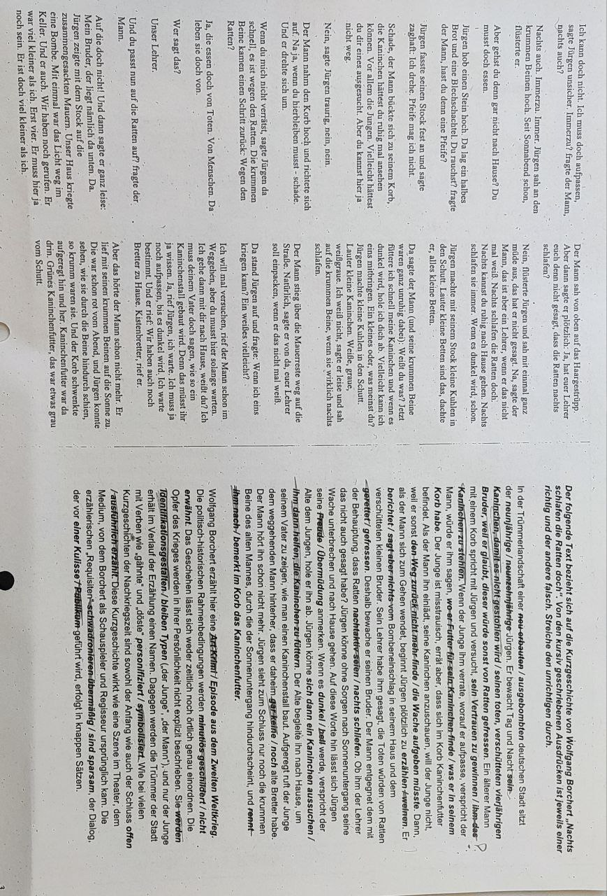
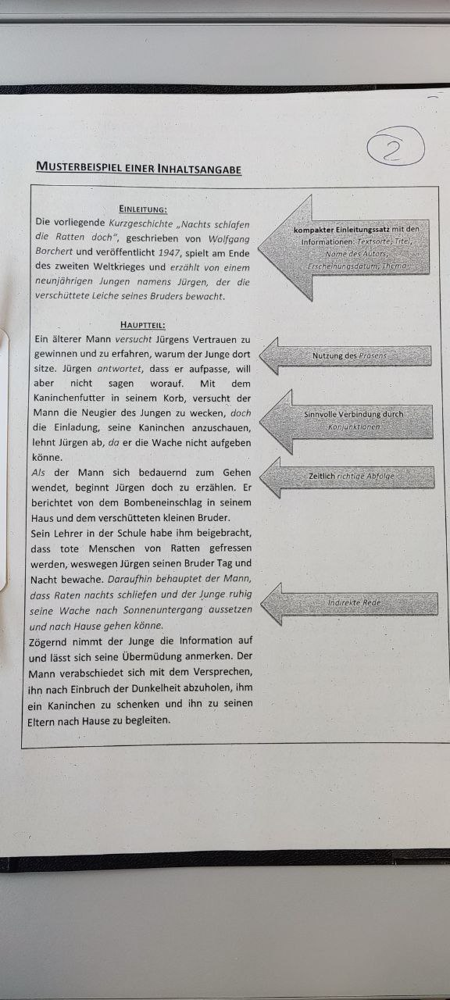

# Inhalt eines Textes wiedergeben

>**Aufbau**
>	Textart und Quelle angeben (Autor/in, Titel), Erscheinungsort und -zeit
>	Inhalt des Textes in ein bis zwei Sätzen zusammenfassen
>	Danach den gesamten Text in eigenen Worten wiedergeben
>	Schluss: persönliche Wertung, wenn sie verlangt wird

>**Zeitform**
>	In der Regel Präsens (Gegenwart)

>**Sprache**
>	Sachlich, verständlich
>	Direkte Rede in indirekter Rede wiedergeben
>	Das Personal (Pronomen persönliches Fürwort) *"ich"* wird zu *er*, *sie* oder *es*
>	Das Possessivpronomen (besitzanzeigendes Fürwort) *unser*, wird zu *ihr*

---

## Beispiel

### Text

[
[

### Lösung

