# ERM Entitäten und Beziehungen

Die Kernelemente des 1976 von Peter Chen vorgestellten Entity-Relationship-Modells (kurz ERM, vgl. Chen 1976) umfassen drei grundlegende Elemente zur Beschreibung von Daten: Entitätstypen, (englisch: Entity-Typ) Beziehungen (englisch: Relationship) und Attribute.

## Entitäten

Unter Entitäten versteht man eine Menge gleichartiger Objekte oder Dinge der realen Welt, die für ein bestimmtes Anwendungsgebiet von Bedeutung sind. Beispiele dafür sind die Gesamtheit aller Produkte oder aller Kunden eines Unternehmens.

In einem Entity-Relationship-Modell (ERM) werden Entitäten als Rechtecke dargestellt, die den Namen der Entität enthalten, zum Beispiel „Kunde“ oder „Produkt“.

**Beispiel**

- Die Menge aller `Kunden` bildet einer Entität, ebenso wie die Menge aller `Produkte` oder `Bestellungen`.
    

[

## Beziehungen

Eine Beziehung beschreibt das Verhalten von Objekten verschiedener Entitäten zueinander und wie sie miteinader verbunden sind.

Durch eine Beziehung wird häufig eine Tätigkeit bzw. eine Funktion oder Aufgabe zwischen diesen Objekten beschrieben. Die Beziehung beschreibt, was ein Objekt einer Entität mit einem Objekt einer anderen Entität „macht“.

In einem Entity-Relationship-Modell (ERM) werden Beziehungen als Rauten dargestellt, die die Bezeichnung der Beziehung enthält.

**Beispiel**

- Die Beziehung `bestellt` beschreibt eine Beziehung zwischen den Entitäten `Kunde` und `Produkt`.
    

[]

# ERM Attribute

Die Attribute beschreiben Eigenschaften von Entitäten und Beziehungen (Beziehungsmerkmal).

Zum Beispiel sind Nachname, Vorname und Kundennummer Attribute der Entitätsmenge Kunde.In einem ERM werden Attribute als Ellipsen dargestellt. Die Attribute werden mit einfachen Linien mit den zugehörigen Entitäten bzw. Beziehungen verbunden.

[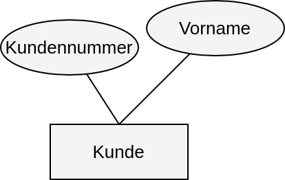]

**Beispiel**

- Ein Produkt hat zum Beispiel die Attribute: Preis und Beschreibung
    
- Das Attribut der Beziehung bestellt ist zum Beispiel: Menge
    
- Weil das Attribut Menge nicht direkt zum Kunden und nicht zum Produkt gehört
    

[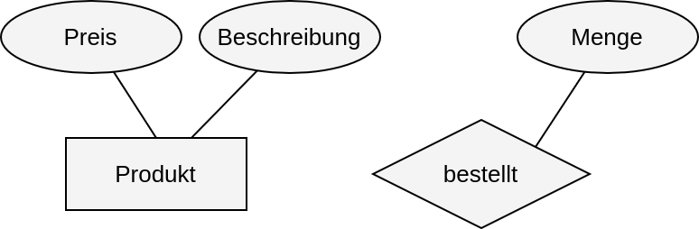]

## Schlüsselattribute und Primärschlüssel

Ein Schlüsselattribut ist ein Attribut, mit dem man jede einzelne Entität (also jedes Objekt in einer Entitätsmenge) eindeutig identifizieren kann. Das wichtigste Schlüsselattribut nennt man Primärschlüssel. Im Entity-Relationship-Modell (ERM) wird der Primärschlüssel unterstrichen dargestellt.

Oft fügt man zu einer Entität ein zusätzliches Attribut hinzu, das nur als eindeutige Kennzeichnung dient. Meist besteht es aus einer fortlaufenden Nummer oder einem eindeutigen Code. Diese Attribute enden häufig auf „Nummer“ oder „ID“.

Beispiele:

- Kundennummer
    
- Mitarbeiter-ID
    
- Schülernummer
    

Mit einem Primärschlüssel kann man sicherstellen, dass jede Entität in der Datenbank eindeutig gefunden und unterschieden werden kann – selbst wenn andere Attribute wie Name oder Adresse mehrfach vorkommen.

[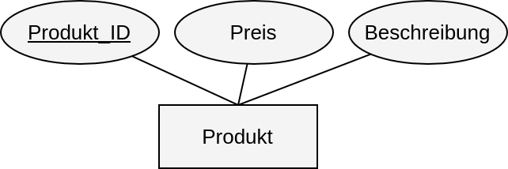]

# ERM Kardinalitäten

Die Kardinalität gibt an, wie viele Objekte aus jeder Entitätsmenge in einer Beziehung mit Objekten aus einer anderen Entitätsmenge stehen können.

Dabei werden zwei Arten für die Kardinalität unterschieden.

- Typ 1: ein Objekt in einer Entitätsmenge steht mit einem anderen Objekt in einer Entitätsmenge in Beziehung.
    
- Typ 2: ein Objekt steht mit mehreren Objekten einer anderen Entitätsmenge in Beziehung.
    

**Beispiel**

- Ein Kunde kauft ein Produkt
    
- Ein Kunde hat mehrere Bestellungen
    

### 1 : 1-Beziehung

Bei einer 1 : 1-Beziehung steht ein Objekt einer Entitätsmenge mit genau einem Objekt in der anderen Entitätsmenge in Beziehung.

 []
 
 []
Man liest die Kardinalitäten dieses ERMs wie folgt:

Ein deutscher Staatsbürger hat **genau eine** Steueridentifikationsnummer, und eine Steueridentifikationsnummer gehört **genau einem** deutschen Staatsbürger.

### 1 : N-Beziehung

Bei einer 1 : N-Beziehung steht ein Objekt einer Entitätsmenge mit mehreren Objekten in der anderen Entitätsmenge in Beziehung.

 
 
 ![[../Img/beziehung1n-2.png]]

Man liest die Kardinalitäten dieses ERMs wie folgt:

Ein Kunde kann **mehrere** Rechnungen bezahlen, und eine Rechnung wird von **genau einem** Kunden bezahlt.

### N : M-Beziehung

Bei einer N : M-Beziehung steht ein Objekt einer Entitätsmenge mit mehreren Objekten in der anderen Entitätsmenge in Beziehung und umgekehrt.

 [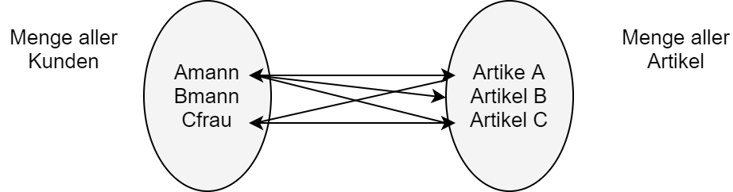]

![[../Img/beziehung-nm2.png]]
Man liest die Kardinalitäten dieses ERMs wie folgt:

Ein Kunde bestellt **mehrere** Artikel, und ein Artikel wird von **mehreren** Kunden bestellt.

Die Buchstaben N und M stehen hier für mehrere Objekte aus einer Entität.

## Kardinalität angeben

Das ERM wird um die Kardinalitäten erweitert. Zu jeder Beziehung müssen **zwei Kardinalitäten** bestimmt werden. Für die Beziehung _bestellt_ können die folgenden beiden Fragen gestellt werden:

1. Ein Kunde wie viele Bestellungen?
    
2. Eine Bestellung hat wie viele Kunden?
    

[
Bei der Festlegung der Kardinalitäten wir immer danach gefragt, mit wie vielen ein Objekt einer Entität mit Objekten einer anderen Entität in Beziehung steht.

- **Ein Kunde** steht mit **wie vielen** Bestellungen in Bezeichnung?
    
- **Eine Bestellung** steht mit **wie vielen** Kunden in Beziehung?
    

### <u> Wichtig </u>

Ein Kunde kann **mehrere** Bestellungen bestellen. Deswegen wird bei Bestellung ein N geschrieben.

[]

### <u> Wichtig </u>

Eine Bestellung kann nur zu **einem** Kunden gehören. Deswegen wird bei Kunde eine 1 geschrieben.

[]

### Gesprochene Darstellung der Kardinalität

 []
 
 ]

# ERM zu Relationenmodell

Eine relationale Datenbank basiert auf dem Prinzip von Tabellen, die untereinander in Beziehung stehen. Allerdings hat ein ERM rein äußerlich noch nicht viel mit Tabellen gemein. Deswegen müssen nun aus unserem bestehenden ER-Modell das Relationenmodell entwickeln.

- Jede Entität im ERM stellt eine Relation dar, die auch den gleichen Namen erhält.
    
- Die Attribute entsprechen den Spalten der Entitä.
    
- Zum Schluss müssen noch die Beziehungen entsprechend der Kardinalitäten festgelegt werden, Auch hier gibt es feste Regeln.
    

Im **1. Schritt** wird anhand des folgenden ERM die Umwandlung jeder Entität in eine Relation mit den Attributen als Spalten erfolgen.

[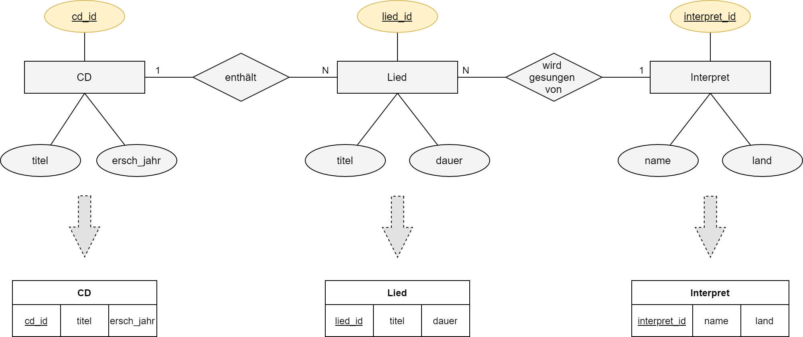]

## Relationenschreibweise

Die oben abgebildete Tabelle (Relationales Datenmodell) kann mann folgendermaßen in der Relationenschreibweise schreiben:

- CD( cd_id , titel, ersch_jahr)

- Lied( lied_id, titel, dauer)

- Interpret( interpret_id, name, land)

Im **2. Schritt** müssen die Beziehungen zwischen den Relationen anhand der angegebenen Kardinalitäten und festen Regeln aufgelöst werden. Gleichzeitig müssen Fremdschlüssel vergeben werden.

Ein Fremdschlüssel stellt die Beziehung zwischen Relationen(Tabellen) dar. Ein Primärschlüssel einer Relation wird in einer anderen Relation zum Fremdschlüssel und stellt die Beziehung her.

## 1:1-Beziehung

Bei einer 1:1 Beziehung nehmen wir den Primärschlüssel einer der beiden Relationen und setzen ihn bei der anderen Relation als Fremdschlüssel ein.

### ER-Modell

[]

### Relationenmodell

[]

### Relationenschreibweise

- deutscher_staatsbürger( ds_id , vorname)

- Steueridentifikationsnummer( id_nr, identifikationsnummer, ds_id)

## 1:N-Beziehung

Bei einer 1:N Beziehung nehmen wir den Primärschlüssel der 1-er Relation und setzen ihn als Fremdschlüssel in die N-Relation ein.

ER-Modell

[]

### Relationenmodell

[]

### Relationenschreibweise

- Kunde( kd_id , nachname)

- Rechnungen( rech_nr, rechnungsnummer, kd_id)

## N:M-Beziehung

Bei einer N:M Beziehung wird eine zusätzliche Relation (Zuordnungstabelle) gebildet, die jeweils die Primärschlüssel der N-Relation und M-Relation als Fremdschlüssel enthält. Damit wird die N:M-Beziehung in zwei 1:N Beziehungen „aufgelöst“.

### ER-Modell

[]

### ER-Modell mit Fremdschlüsseln

[]

### Relationenmodell

[]

### Relationenschreibweise

- Kunde( kd_id , nachname)

- Artikel( artikel_id, artikelnummer)

- Bestellung( bestell_id, kd_id, artikel_id)

## Beispiel

ERM

[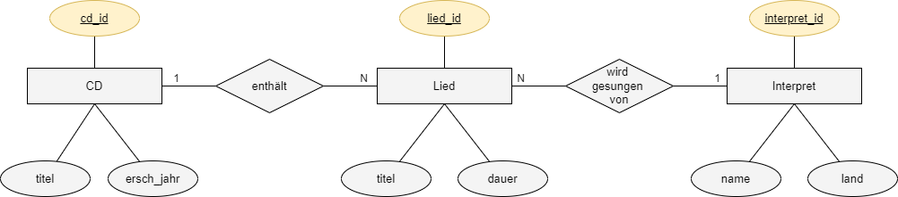]

Relationenmodell

[]

Tabellenform

[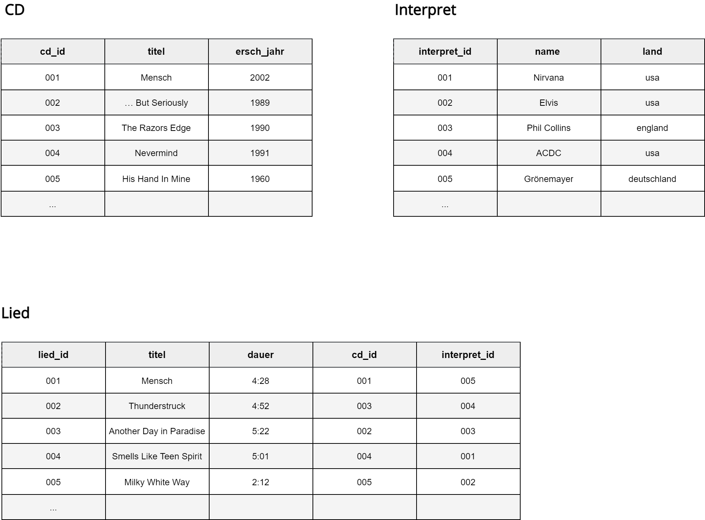]

# ERM-Erweiterung

## Beziehung auf eine Entität

Beziehungen müssen nicht zwangsläufig zwischen genau zwei Entitäten definiert sein. Es gibt auch Beziehungen, die auf einer einzigen Entität basieren.

### 1:1-Beziehung

Eine **1:1-Beziehung** auf einer Entität, entsteht durch die Beziehung, dass jeder Bundeskanzler genau einen Nachfolger hat.

[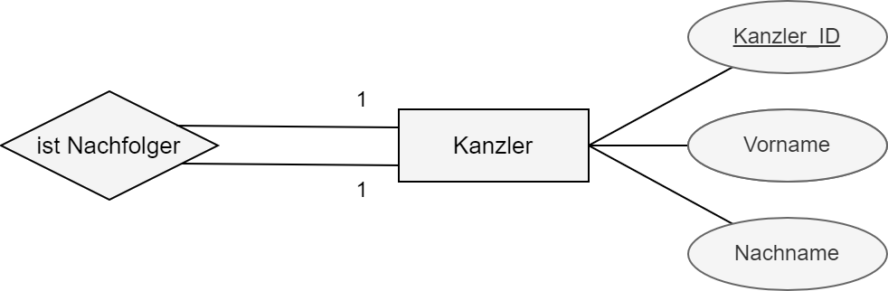]

- Ein Kanzler hat genau **einen** Nachfolger.
    
- Ein Kanzler ist Nachfolger genau **eines** Kanzler.
    

### 1:N-Beziehung

Ein Beispiel für eine **1:N-Beziehung**, die nur auf einer Entität, nämlich der Entität **Mitarbeiter**, definiert ist, stellt die Beziehung **ist Vorgesetzter** dar.

Ein Mitarbeiter ist Vorgesetzter mehrere Mitarbeiter. Ein Mitarbeiter hat einen Mitarbeiter als Vorgesetzten.

[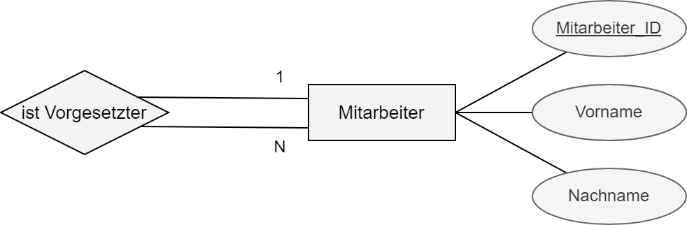]

- Ein Vorgesetzter (Mitarbeiter) ist Vorgestzter von **mehreren** Mitarbeitern.
    
- Ein Mitarbeiter hat nur **einen** Vorgesetzten (Mitarbeiter).
    

### N:M-Beziehung

Eine chemische Substanz kann aus mehreren anderen chemischen Substanzen besthen. Dies kann als **N:M-Beziehung** dargestellt werden.

[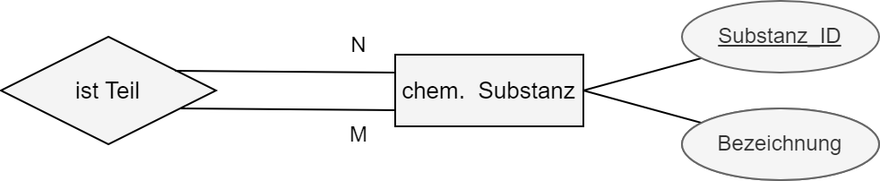]

- Eine chemische Substanz kann aus **mehreren** anderen chemischen Substanzen zusammengesetzt sein.
    
- Eine chemische Substanz kann Bestandteil von **mehreren** anderen chemischen Substanzen sein.
    

## Generalisierung und Spezialisierung

Die Modellierungskonstrukte „Generalisierung“ und „Spezialisierung“ stellen besondere Beziehungstypen zur Strukturierung großer Datenstrukturen dar.

### Generalisierung

Bei der **Generalisierung** werden ähnliche Entitätsmengen zu einer übergreifenden Entitätsmenge zusammengefasst.

Das Konzept erlaubt es, gemeinsame Attribute von Entitätsmengen einer neuen übergeordneten Entitätsmenge zuzuordnen. Jedem Entity der spezialisierten Entitätsmenge entspricht ein Entity der generalisierten Entitätsmenge.

Sie wird mit einer **ist ein-Beziehung** mit den untergeordneten Spezialisierungstypen verknüpft.

Attribute einer übergeordneten Entität werden an die untergeordnete Entität vererbt. Dies erleichert den Darstellungsaufwand.

[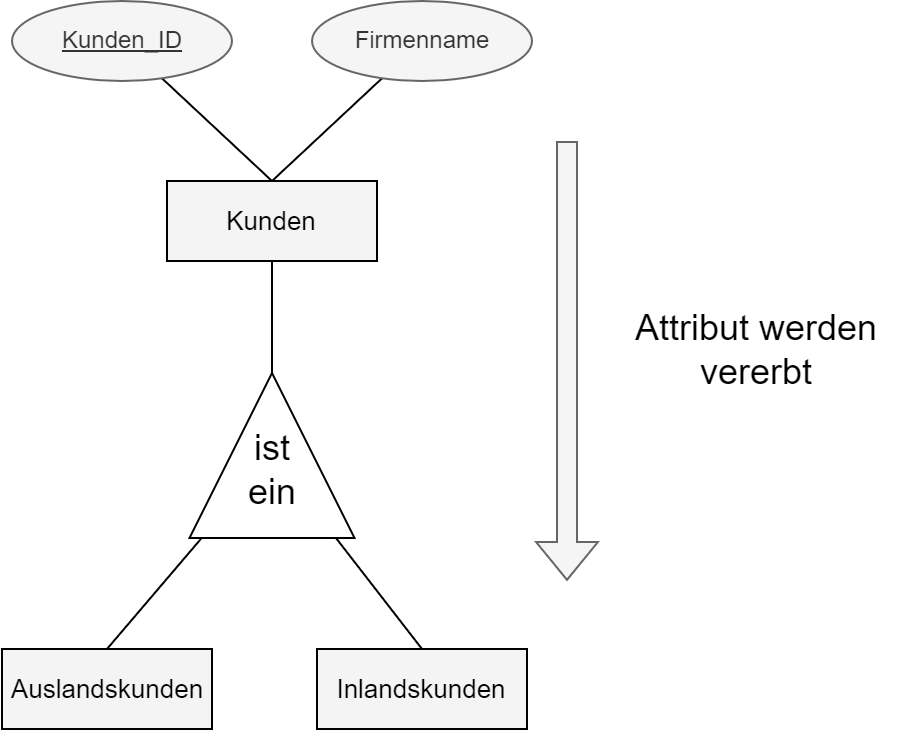]

### Spezialisierung

Bei der **Spezialisierung** erhält die übergeordnete Entität die Attribute, die die untergeordneteten Entitäten auch besitzen sollen. Zusätzlich erhalten die untergeordneten Entitäten eigene zusätzliche Attribute, die die Entität weiter genauer beschreiben.

[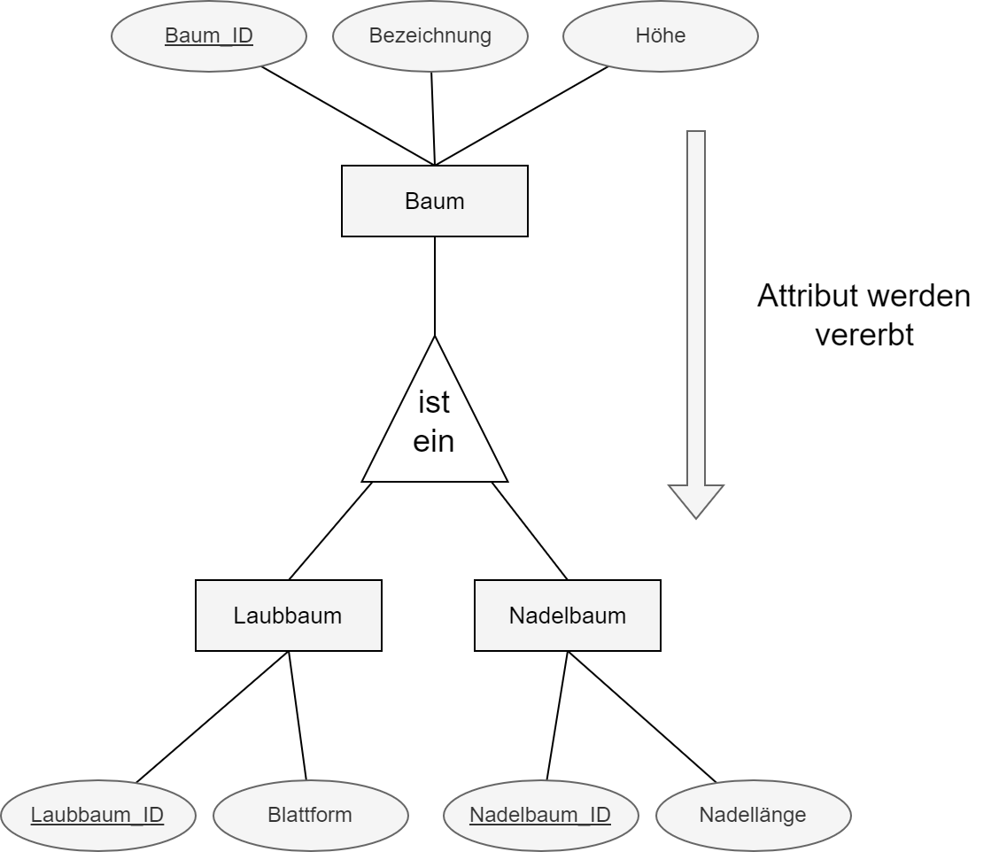]

- Ein Datensatz der untergeordneten Entität steht immer mit genau einem Datensatz der übergeordneten Entität in Beziehung - eine 1 zu 1- Beziehung. Die Angabe der Kardnialität kann daher weggelassen werden.
    
- Der Primärschlüssel der übergeordneten Entität ist zugleich der Primärschlüssel der untergeordneten Entität.
    

## ERM Erweiterungen zu Relationenmodell

### Beziehung auf eine Entität zu Relationenmodell

Bei Beziehungen, die auf eine Entität definiert sind, können die bereits bekkannten Überführungsregeln für 1:1-Beziehungen, 1:N-Beziehungen und N:M-Beziehungen angewendet werden.

Es ist darauf zu achten, dass keine Spalte mit gleichen Namen entstehen. Die Fremdschlüssel müssen durch sinnvolle Zusätze umbenannt werden.

### Generalisierung/Spezialisierung zu Relationenmodell

Jede Entität einer Generalisierung/Spezialisierung erfordert eine eigene Tabelle. Der Primäschlüssel der übergeordneten Entität ist zugleich der Primärschlüssel der untergeordneten Entität.